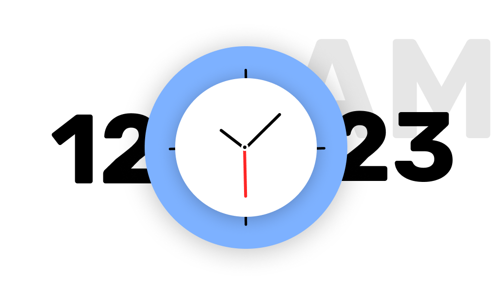
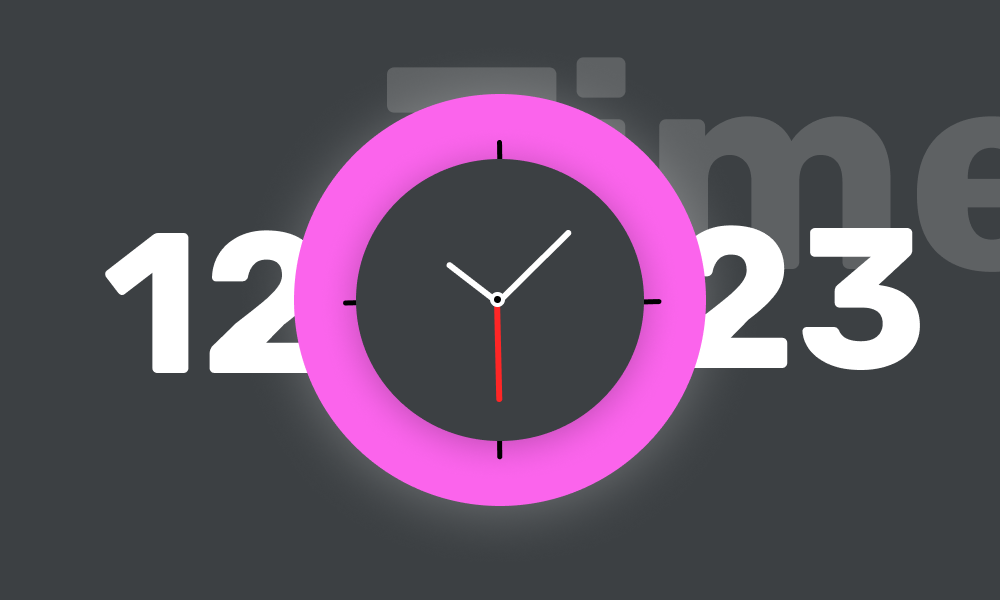

# Flutter clock challange

[![CC BY 4.0][cc-by-shield]][cc-by]

This work is licensed under a [Creative Commons Attribution 4.0 International
License][cc-by].

[cc-by]: http://creativecommons.org/licenses/by/4.0/
[cc-by-shield]: https://img.shields.io/badge/License-CC%20BY%204.0-lightgrey.svg

This clock is made for the submission in Flutter clock challange.

## To run this clock follow the steps given below

1. Clone this git repo
2. go to the <code>./analog_clock</code> folder
3. run <code>flutter run</code> in your terminal

That's it.

The UI of the clock is given below

This is light mode

This is dark mode

Don't edit the Flutter_clock_helper file.